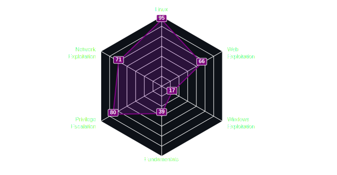

##  

##                    
★ *Hi, I'm an 18 years old cybersecurity student, and I'm passionate about protecting the digital world.*  
★ *I love learning about ethical hacking and web exploitation, and I'm studying for a cybersecurity degree.*  
★ *I keep up to date with the latest trends and technologies through competitions and challenges.*  
★ *My goal is to work as a cybersecurity analyst or penetration tester to defend against malicious attacks.*  
  
## For more :
 

[Visit **My websites**](https://achux21.online/) to know more about Me. 🚀

 

[Visit **My Blog**](https://iloveweb.online/) for more Writeups.🔥

## Hobbies : 

   ★ *Watching Anime*  
   ★ *Listening to music*  
   ★ *Playing CTFs*  
   ★ *Watching Netflix*  

# My TryHackMe Profile :

   

# My Ctftime Profile :

    

# Skill-Matrix :

